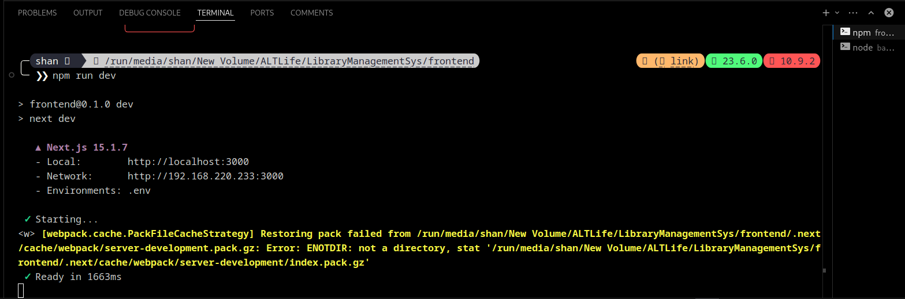

# Validation Document

## 1. Task Completion Summary

This document validates the completion of the Library Management System project, which includes:
- A **Next.js** frontend with Tailwind CSS
- A **Node.js + Express.js** backend with MySQL
- **Docker** for MySQL containerization and deployment
- **API Development** for book borrowing, returns, and statistics
- **DevOps Integration** with CI/CD and Nginx reverse proxy

---

## 2. Screenshots of Work Done

### Backend Running
_(Attach a screenshot of the terminal showing `npm run dev` execution)_

### Frontend Running
_(Attach a screenshot of the terminal showing `npm run dev` execution and the application UI)_

### MySQL Container Running
_(Attach a screenshot of `docker ps` showing the running MySQL container)_

### API Testing (Postman/Browser)
- `GET /api/stats` (Never Borrowed Books)
- `GET /api/stats` (Outstanding Books)
- `GET /api/stats/pending-returns/:date`
_(Attach screenshots of API responses)_

### UI Dashboard
_(Attach a screenshot of the dashboard tracking book returns)_

### Deployment Proof
_(Attach screenshots of CI/CD pipeline or Nginx configuration if applicable)_

---

## 3. GitHub Proof of Work

### Repository Overview
_(Attach a screenshot of the GitHub repository, including backend, frontend, and Docker configurations)_

### Commit History
_(Attach a screenshot showing meaningful commit messages and contributions)_

### Pull Requests & Issues
_(Attach a screenshot if applicable, showing contributions via pull requests or issue tracking)_

---

## 4. Conclusion

The project is fully implemented with backend, frontend, database, and DevOps best practices. The above screenshots validate the completion and working state of the Library Management System.

_(End of Document)_

