# Validation Document

## 1. Task Completion Summary

This document validates the completion of the Library Management System project, which includes:
- A **Next.js** frontend with Tailwind CSS
- A **Node.js + Express.js** backend with MySQL
- **Docker** for MySQL containerization and deployment
- **API Development** for book borrowing, returns, and statistics
- **DevOps Integration** with CI/CD and Nginx reverse proxy

---

## 2. Screenshots of Work Done

### Backend Running
_(Attach a screenshot of the terminal showing `npm run dev` execution)_
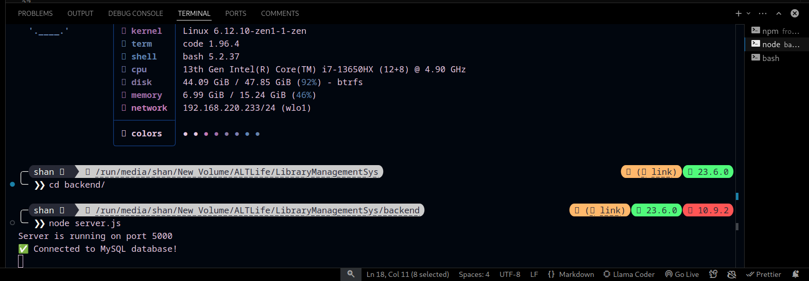

### Frontend Running
_(Attach a screenshot of the terminal showing `npm run dev` execution and the application UI)_

### MySQL Container Running
_(Attach a screenshot of `docker ps` showing the running MySQL container)_
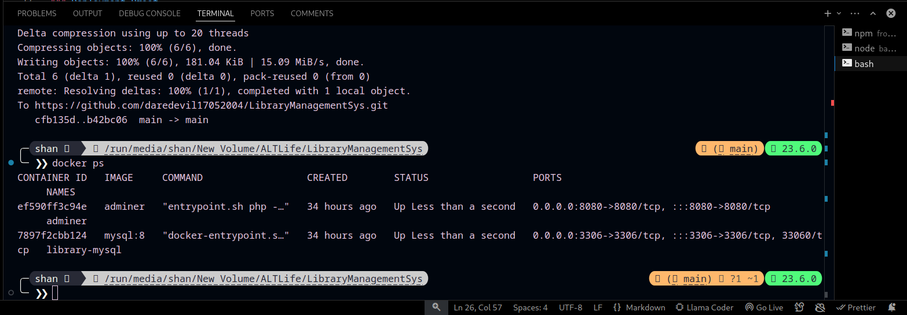

### API Testing (ThunderClient)
- `GET /api/library-stats` (Library-Stats API response)
_(Attach screenshots of API responses)_
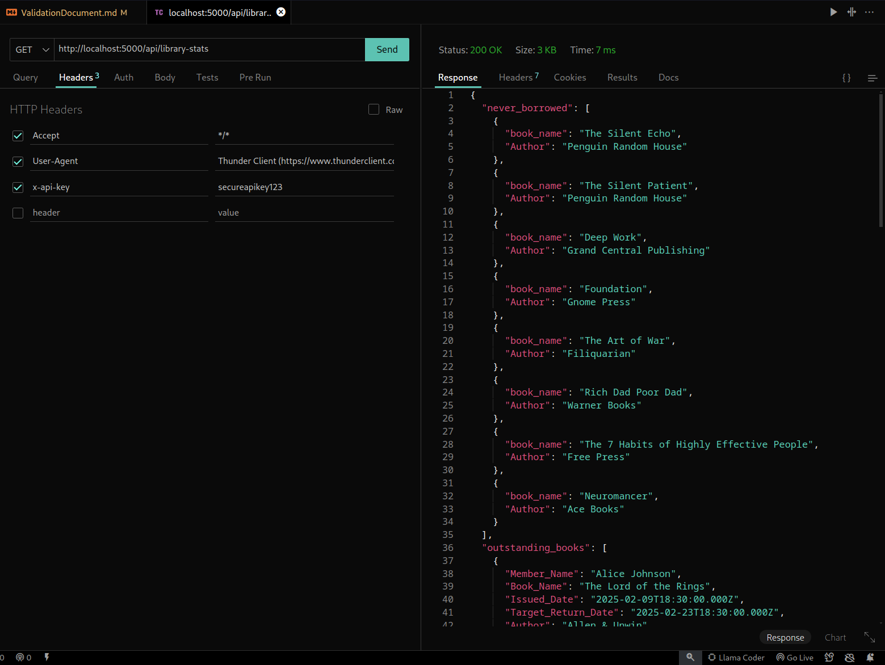

- `GET /api/books/3` (books fetching api)
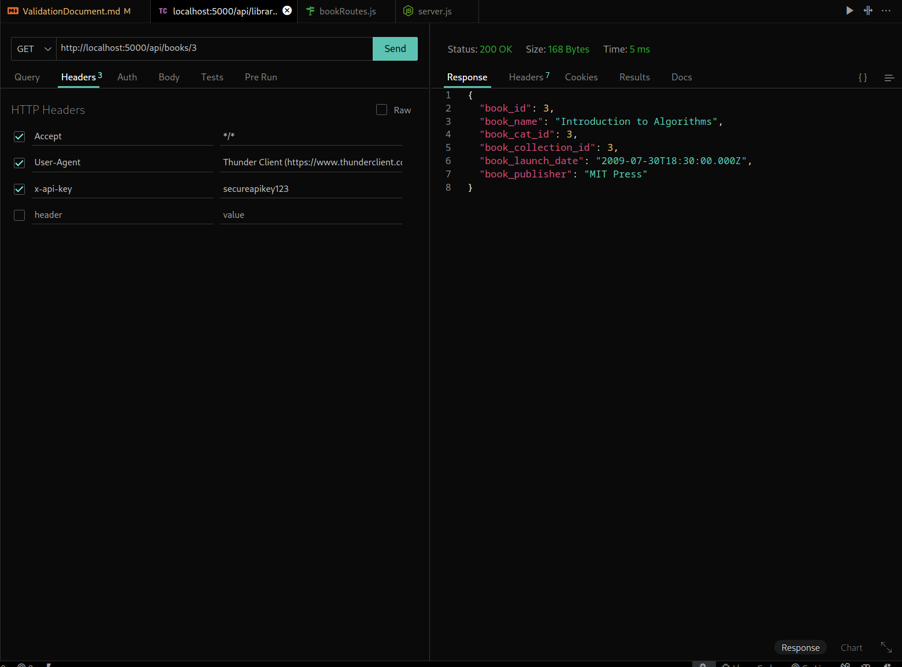

- `POST /api/books`(books creation api)
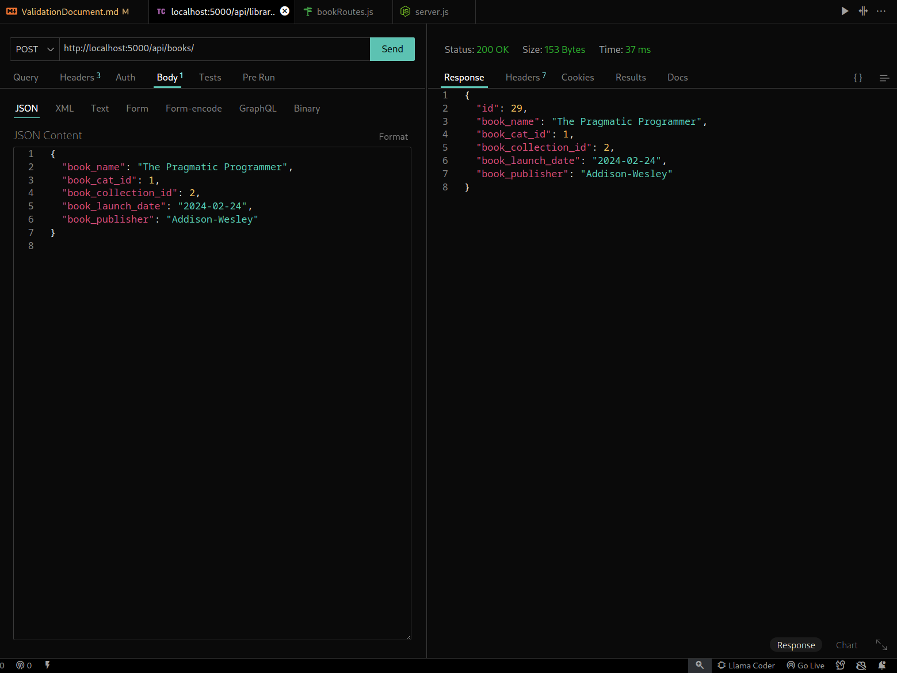

- `PUT /api/books/29` (books updating api, 29 is the id for book returns api)
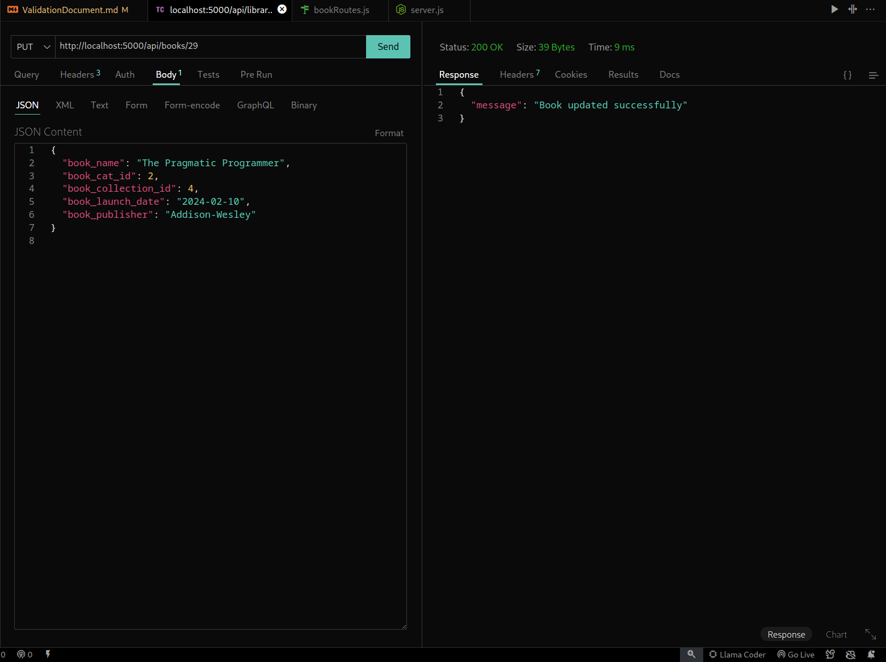

- `GET /api/members/3` (members fetching api)
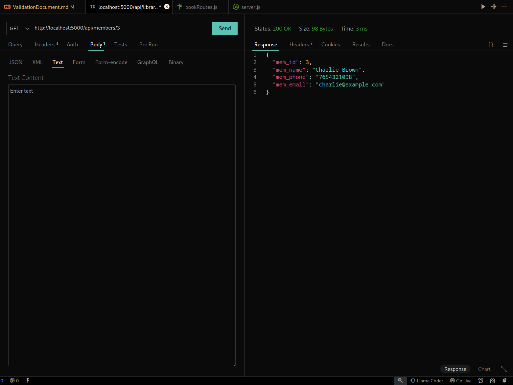

- `POST /api/members`(members creation api)
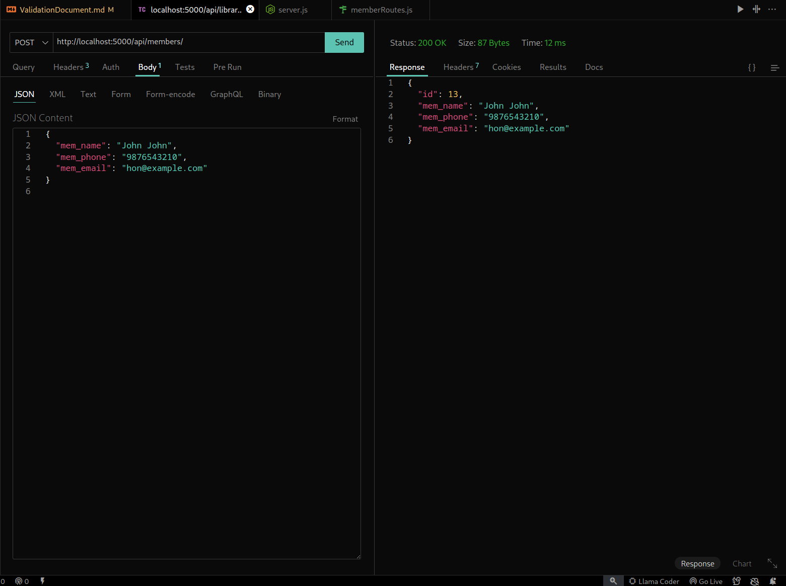

- `PUT /api/members/13` (members updating api, 13 is the id for member updating api)
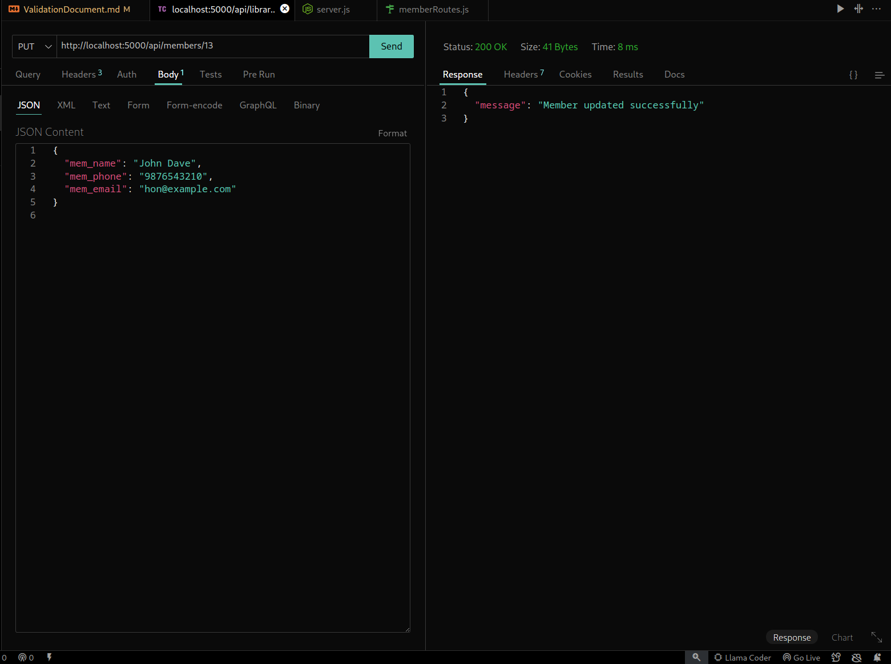

- `GET /api/issuance/5` (issation api )
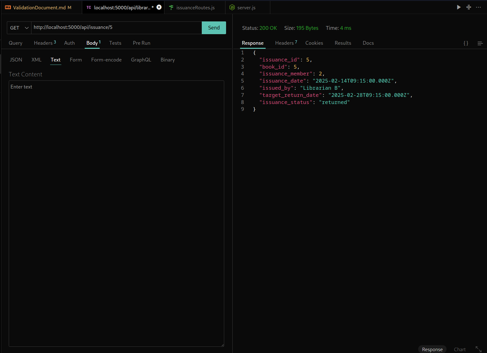

- `POST /api/issuance`(isssuaction creation api)
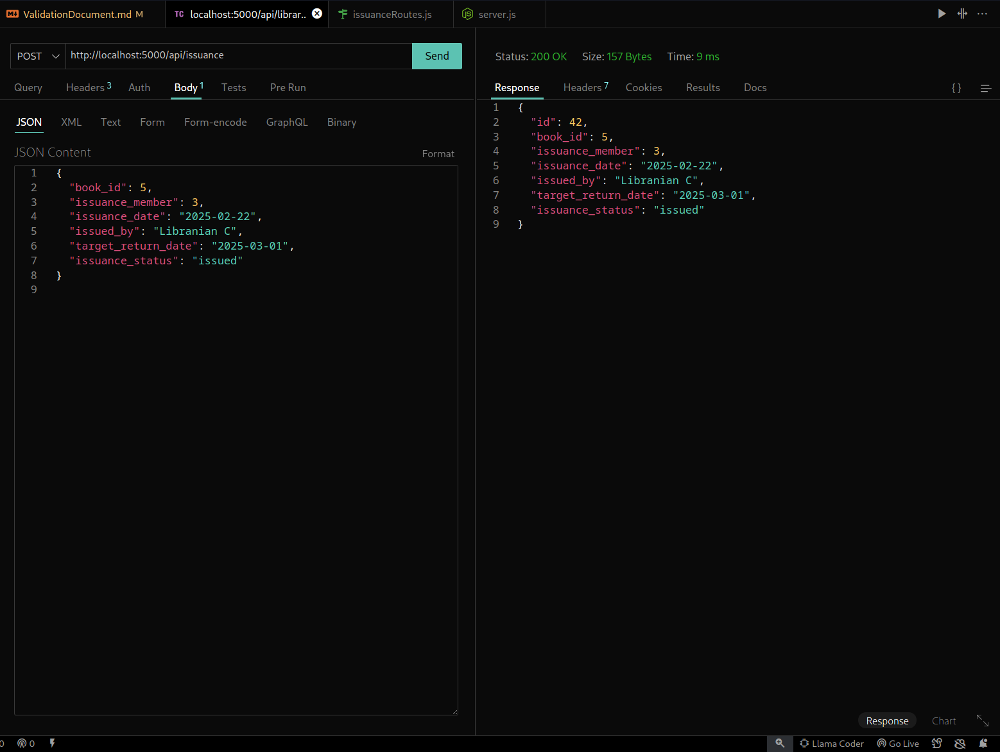

- `PUT /api/issuance/5` (issuaction updating api, 5 is the id for issuaction api )
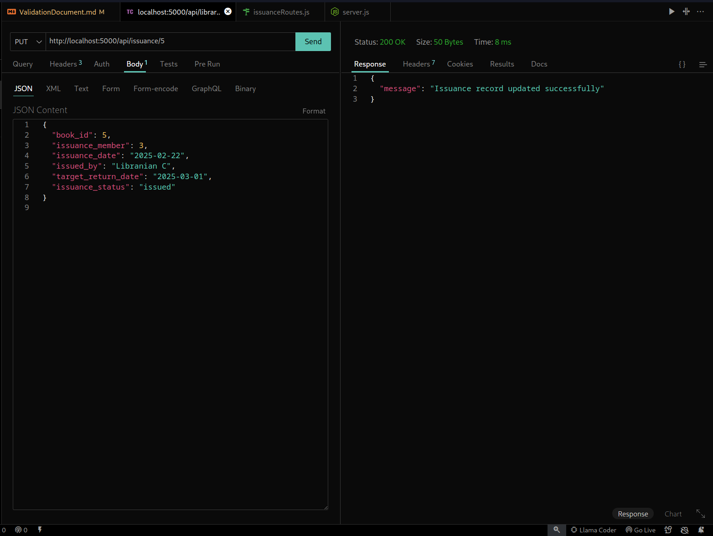

### UI Dashboard
_(Attach a screenshot of the dashboard tracking book returns)_
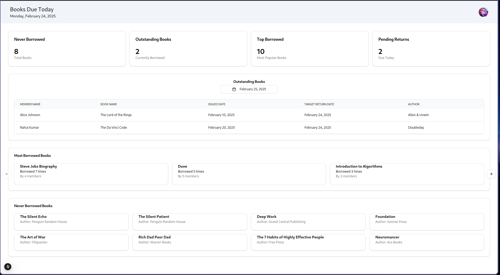

---

## 3. GitHub Proof of Work

### Repository Overview
_(Attach a screenshot of the GitHub repository, including backend, frontend, and Docker configurations)_
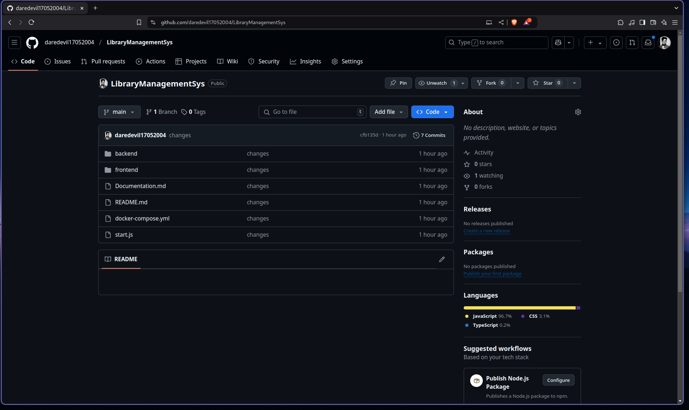

### Commit History
_(Attach a screenshot showing meaningful commit messages and contributions)_
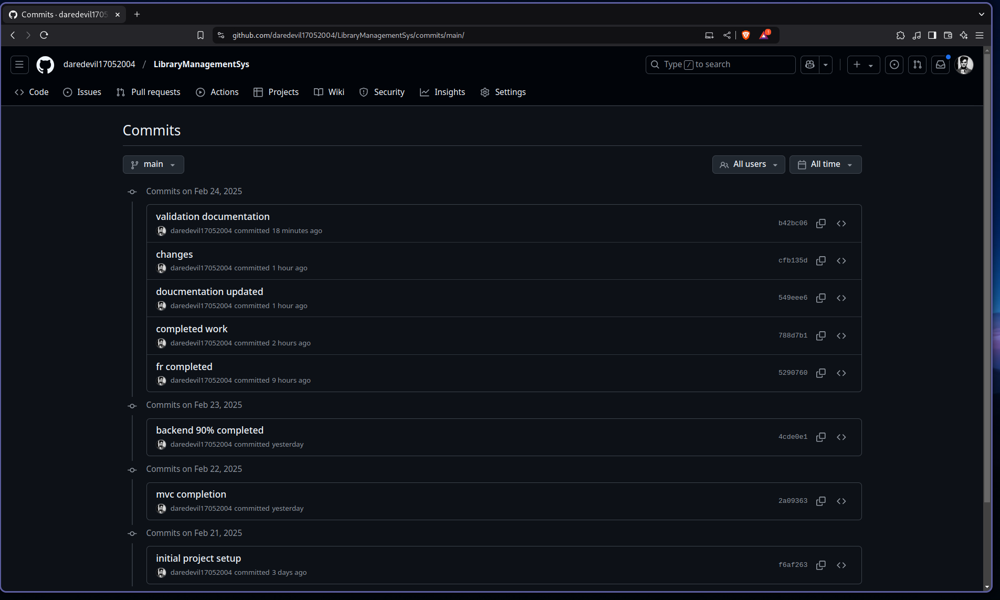

---

## 4. Conclusion

The project is fully implemented with backend, frontend, database, and DevOps best practices. The above screenshots validate the completion and working state of the Library Management System.

_(End of Document)_

